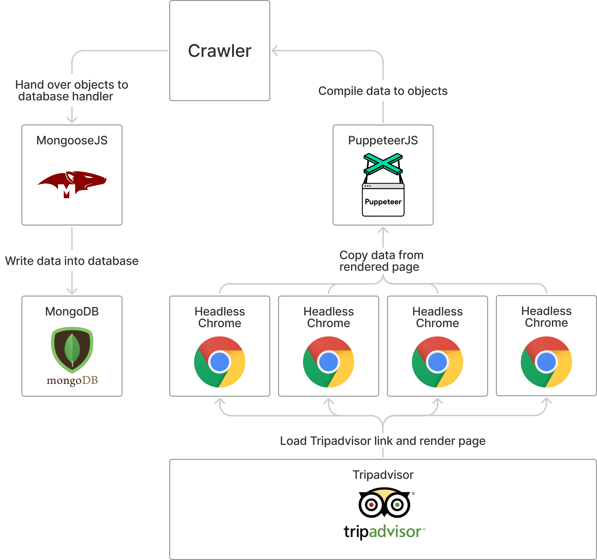

# Tripadvisor Crawler

This is a placeholder, later the data retrieved by the crawler will be presented here.
The data will be published after anonymisation and aggregation.

The crawler started multiple headless chrome instances over puppeteerto render the Tripadvisor website. Then puppeteer extracted the inter-esting data and the crawler packaged them in either a restaurant, review,or user object. This object then got handed over to the database handlerwhich was implemented with mongoose. The database handle then wrotethe objects into MongoDB. 

